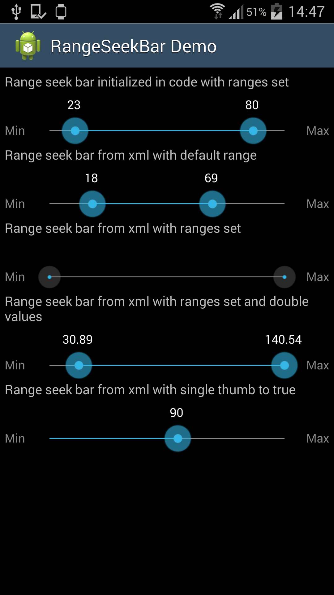

# === PROJECT MOVED ===

The home for this project has moved over to the following repository: https://github.com/anothem/android-range-seek-bar

You can continue using this repo, but new pull requests and issues will *not* be looked at. For the most up to date and actively maintained version of this project, please head over to the new repository above.  

Thank you.

--Alex


range-seek-bar
======================

# Introduction

This is a fork of the following project: https://code.google.com/p/range-seek-bar/ under Apache license.

It provides a SeekBar similar to the default Android one, but with two thumb controls allowing a range to be selected, and some other extras as well.



# Modifications in fork from original project

Feature additions are:

* Ability to initialise from XML, with attributes (only tested for Integer and Double, would not support all the original types that the class supports when initialized programmatically)
* Ability to make the range-seek-bar only use one thumb instead of two, with all other feature remaining; can be set from XML.
  This makes it more similar to the default android seekbar, but you still benefit from the other features and very smooth animation.
* Text labels at beginning and end integrated in the RangeSeekBar view itself
* Floating text above the thumbs that shows the value selected by the thumb
* Styling changes — thinner line, the progress bar shows as “disabled” (line grey, buttons grey, no text labels) when the values are at default min/max
* I’ve also added a PixelUtils class that does Px to Dp and Dp to Px conversions.

# How to run demo

This repository contains an ant-based Android project which runs a demo app showing off some of the features of the range-seek-bar and ways of utilizing it.
You should be able to import and run like any other Android app.

# How to use in your own project

## Setup as Gradle dependency

* Add this in your build.gradle file:

 * For latest release: 

```groovy
	dependencies {
    	compile 'com.yahoo.mobile.client.android.util.rangeseekbar:rangeseekbar-library:0.1.0'
	}
```

 * For the latest work-in-progress snapshot:

```groovy
	dependencies {
    	compile 'com.yahoo.mobile.client.android.util.rangeseekbar:rangeseekbar-library:0.2.0-SNAPSHOT'
	}
```

## Copy/paste relevant files

Copy the following into your own project:
* [Java source files from src/com/yahoo/mobile/client/android/util](rangeseekbar/src/main/java/com/yahoo/mobile/client/android/util)
* [Attributes for XML use](rangeseekbar/src/main/res/values/attrs.xml)
* [Image files from res/drawable-xhdpi](rangeseekbar/src/main/res/drawable-xhdpi) (or use your own): [seek_thumb_disabled.png](rangeseekbar/src/main/res/drawable-xhdpi/seek_thumb_disabled.png), [seek_thumb_normal.png](rangeseekbar/src/main/res/drawable-xhdpi/seek_thumb_normal.png), [seek_thumb_pressed.png](rangeseekbar/src/main/res/drawable-xhdpi/seek_thumb_pressed.png)

Then you can use this in your layouts, either programmatically instantiating like in [DemoActivity](rangeseekbar-sample/src/main/java/com/yahoo/mobile/client/android/demo/DemoActivity.java) or through XML, like in [main.xml](rangeseekbar-sample/src/main/res/layout/main.xml)


# License

The images are licensed under Creative Commons ( http://creativecommons.org/licenses/by/3.0/ ). The originals are provided in the original project ( https://code.google.com/p/range-seek-bar/ ) and seek_thumb_disabled.png is added by us.

The source code is licensed under the Apache License. A copy of this can be found at http://www.apache.org/licenses/LICENSE-2.0 and has been included in the repository as well.
